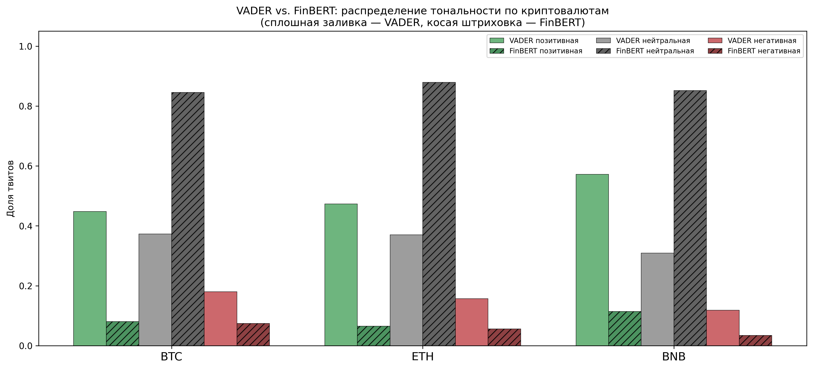
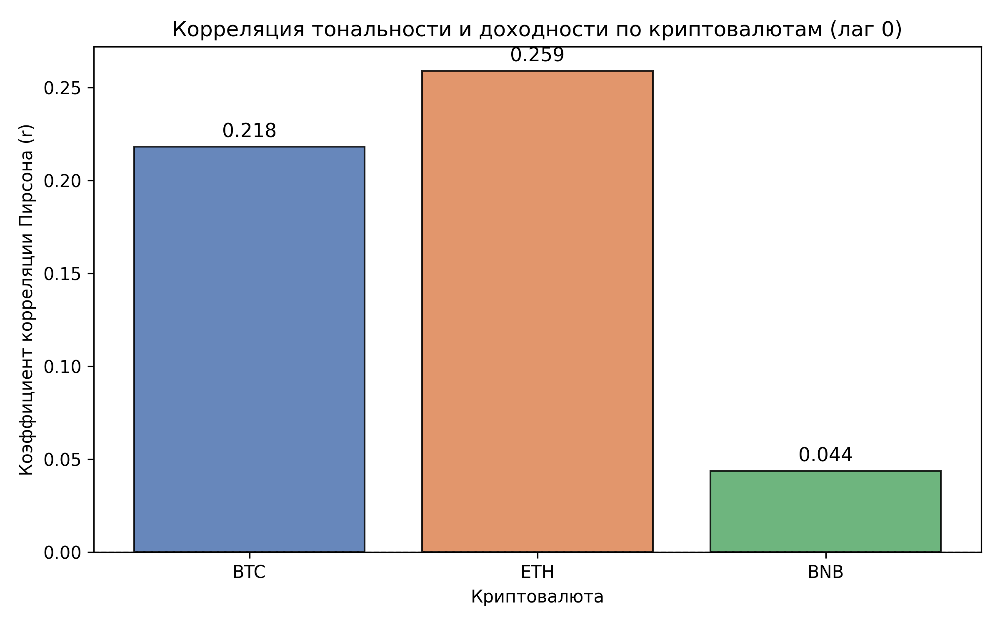
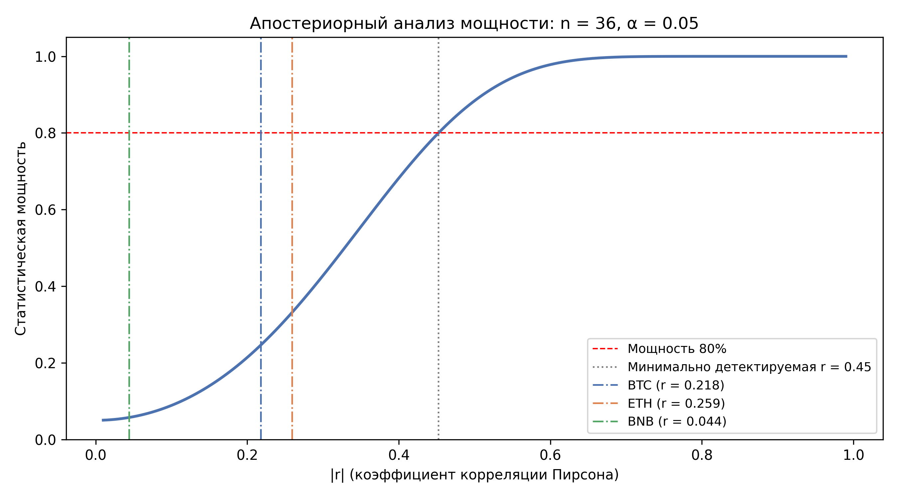
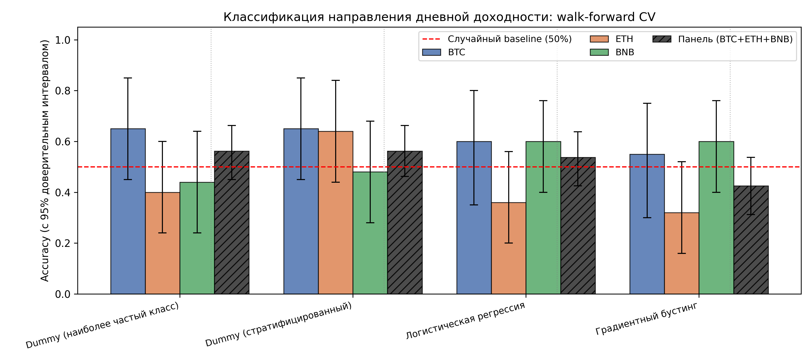
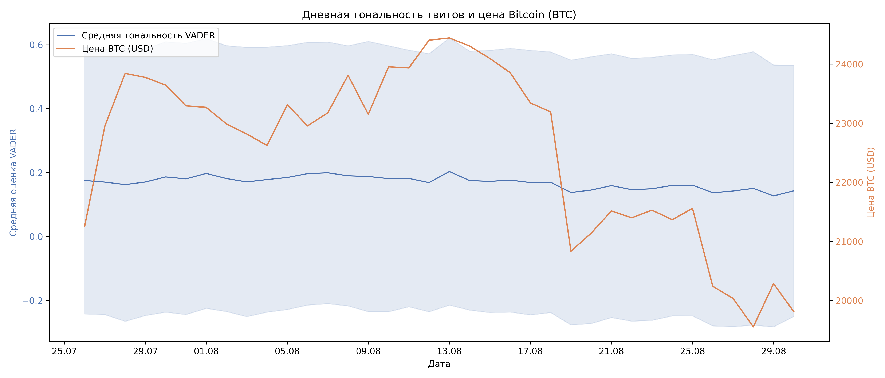
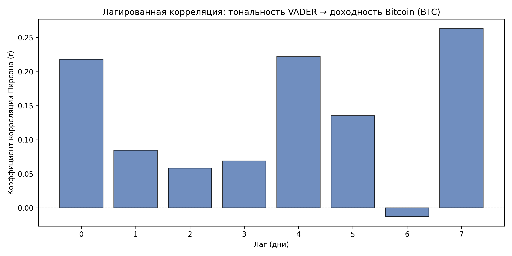
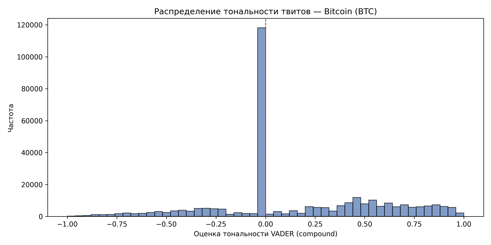
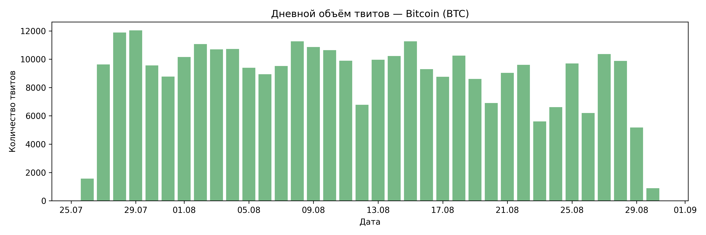
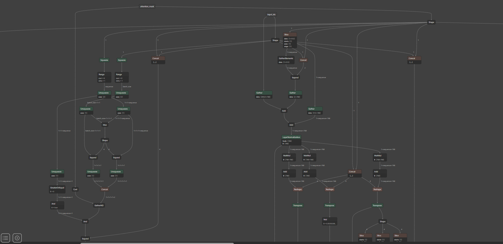

# Исследование изменения стоимости криптовалют на основе сообщений участников рынка

[](https://github.com/iragoum/crypto-sentiment-analysis/actions/workflows/ci.yml)
[](https://www.python.org/)
[](LICENSE)

Выпускная квалификационная работа по направлению **02.03.02 «Фундаментальная информатика и информационные технологии»**.

**Студент:** Мугари Абдеррахим, группа НФИбд-01-22  
**Научный руководитель:** доц., к.т.н. Молодченков А.И.  
**Кафедра:** Математического моделирования и искусственного интеллекта (ММИИ)  
**Университет:** Российский университет дружбы народов имени Патриса Лумумбы, 2026

---

## О работе

Исследование статистической взаимосвязи между **тональностью сообщений участников рынка в Twitter** и **динамикой стоимости криптовалют Bitcoin (BTC), Ethereum (ETH) и Binance Coin (BNB)**.

Применяются два подхода к анализу тональности:
- **VADER** — лексиконный метод, оптимизированный для текстов социальных медиа
- **FinBERT** (`ProsusAI/finbert`) — трансформерная модель, дообученная на финансовых текстах (109,5 млн параметров)

Статистический анализ включает корреляционный анализ, тест причинности Грейнджера (на исходных и дифференцированных рядах), тест стационарности Дики–Фуллера, апостериорный анализ мощности и бинарную классификацию направления доходности.

| Параметр | Значение |
|---|---|
| Набор данных | 703 536 отфильтрованных твитов (BTC: 321 627 · ETH: 306 738 · BNB: 75 171) |
| Период наблюдения | 26 июля — 30 августа 2022 года (36 дней) |
| Методы анализа тональности | VADER + FinBERT (CPU) |
| Статистические тесты | Pearson/Spearman · Granger · ADF · Power analysis |
| Классификаторы | Логистическая регрессия · Gradient Boosting · DummyClassifier |
| Тестов | 354 автоматизированных теста · Python 3.10 / 3.11 / 3.12 |

---

## Структура репозитория

```
.
├── code/
│   ├── .github/workflows/ci.yml   # CI: Python 3.10 / 3.11 / 3.12
│   ├── src/
│   │   ├── data_loader.py          # Загрузка и валидация твитов
│   │   ├── preprocessor.py         # Очистка текста (раздельно для VADER и FinBERT)
│   │   ├── sentiment_analyzer.py   # Оценка тональности VADER + FinBERT
│   │   ├── price_fetcher.py        # Цепочка источников цен: Binance → CoinGecko → fallback
│   │   ├── binance_loader.py       # Агрегация 1-мин OHLCV → дневные цены
│   │   ├── correlation_analyzer.py # Корреляция, Грейнджер, ADF, дифференцирование рядов
│   │   ├── power_analysis.py       # Мощность теста через Fisher z, минимально детектируемый r
│   │   └── predictor.py            # Классификатор направления доходности, walk-forward CV, bootstrap CI
│   ├── tests/                      # 354 pytest-теста
│   ├── data/processed/             # Кэш дневных цен BTC / ETH / BNB (включён в репозиторий)
│   ├── results/
│   │   ├── btc/    figures/ + tables/
│   │   ├── eth/    figures/ + tables/
│   │   ├── bnb/    figures/ + tables/
│   │   ├── cross_crypto/           # Сравнительный анализ трёх криптовалют
│   │   ├── prediction/             # Метрики классификатора по каждому активу + панель
│   │   └── finbert_torchinfo.txt   # Сводка архитектуры FinBERT (torchinfo)
│   ├── main.py                     # Сквозной конвейер из 12 шагов
│   ├── convert_data.py             # Фильтрация сырых Kaggle CSV → наборы по криптовалютам
│   ├── requirements.txt
│   └── requirements-test.txt
└── README.md
```

---

## Конвейер обработки данных

`main.py` реализует **12 последовательных шагов**:

```
Шаг  1  Загрузка       Чтение отфильтрованных твитов для выбранной криптовалюты
Шаг  2  Предобработка  Очистка; формирование оригинального (VADER) и чистого (FinBERT) вариантов текста
Шаг  3  VADER          Лексиконная оценка тональности → compound ∈ [-1, +1]
Шаг  4  FinBERT        3-классовый инференс (позитивный / нейтральный / негативный) на CPU
Шаг  5  torchinfo      Вывод сводки архитектуры FinBERT
Шаг  6  Цены           Загрузка дневных OHLCV: Binance Vision → CoinGecko → fallback
Шаг  7  Агрегация      Дневная тональность объединяется с доходностью
Шаг  8  Корреляция     Pearson и Spearman (лаги 0–7), корреляционная матрица
Шаг  9  Грейнджер (исх.) Тест причинности на исходных рядах (лаги 1–4)
Шаг 10  Грейнджер (дифф.) ADF → первая разность при нестационарности → тест Грейнджера
Шаг 11  Мощность       Апостериорный анализ мощности для наблюдаемых r; минимально детектируемый r при 80%
Шаг 12  Классификатор  LR / GBM / Dummy, walk-forward CV, bootstrap 95% CI
```

---

## Установка

```bash
git clone https://github.com/iragoum/crypto-sentiment-analysis.git
cd crypto-sentiment-analysis/code

# Виртуальное окружение
python -m venv venv
source venv/bin/activate        # Linux / macOS
venv\Scripts\activate           # Windows

# PyTorch CPU-only (GPU не требуется)
pip install torch --index-url https://download.pytorch.org/whl/cpu

# Остальные зависимости
pip install -r requirements.txt
```

> FinBERT загружается автоматически при первом запуске через HuggingFace Hub (~450 МБ).

### Набор данных

Сырые твиты в репозиторий **не включены**. Загрузите датасет с Kaggle:  
[kaggle.com/datasets/ilariamazzoli/3-million-tweets-cryptocurrencies-btc-eth-bnb](https://www.kaggle.com/datasets/ilariamazzoli/3-million-tweets-cryptocurrencies-btc-eth-bnb)

Распакуйте в `code/data/raw/`, затем запустите фильтрацию:

```bash
python convert_data.py --crypto all   # формирует tweets_{btc,eth,bnb}.csv
```

Дневные ценовые данные (`data/processed/`) уже включены в репозиторий.

---

## Запуск

```bash
# Полный конвейер по трём криптовалютам (VADER + FinBERT)
python main.py --crypto all

# Только VADER (быстро, ~5 минут)
python main.py --crypto all --skip-finbert

# Одна криптовалюта
python main.py --crypto btc
python main.py --crypto eth
python main.py --crypto bnb
```

---

## Результаты

### Объём данных

| Актив | Сырых твитов | После фильтрации | Удалено | Дней |
|-------|-------------|-----------------|---------|------|
| BTC   | 737 089     | **321 627**     | 56,4 %  | 36   |
| ETH   | 739 618     | **306 738**     | 58,5 %  | 36   |
| BNB   | 232 155     | **75 171**      | 67,6 %  | 36   |
| Итого | 1 708 862   | **703 536**     | —       | —    |

Этапы фильтрации: язык=EN → дедупликация ID → дедупликация нормализованного текста → удаление ретвитов → удаление спама и ботов → минимум 4 слова.

---

### Сравнение VADER и FinBERT

| Актив | VADER пол. | VADER нейтр. | VADER отриц. | FinBERT пол. | FinBERT нейтр. | FinBERT отриц. | Согласие |
|-------|-----------|-------------|-------------|-------------|---------------|---------------|---------|
| BTC   | 44,8 %    | 37,3 %      | 18,0 %      | 8,0 %       | 84,5 %        | 7,4 %         | 42,0 %  |
| ETH   | 47,3 %    | 37,0 %      | 15,7 %      | 6,5 %       | 87,9 %        | 5,6 %         | 40,7 %  |
| BNB   | 57,2 %    | 30,9 %      | 11,9 %      | 11,4 %      | 85,2 %        | 3,4 %         | 40,0 %  |

FinBERT классифицирует **84–88 % твитов как нейтральные** — следствие доменного смещения (модель обучена на формальных финансовых текстах, применяется к неформальным текстам социальных сетей). VADER демонстрирует более равномерное распределение и значительно бо́льшую дисперсию дневных агрегатов, что делает его предпочтительным для корреляционного анализа.



---

### Корреляция Пирсона — тональность VADER vs дневная доходность (лаг 0)

| Актив | r     | p-значение | Значимо (α = 0,05)? | Мощность теста |
|-------|-------|-----------|---------------------|---------------|
| BTC   | 0,218 | 0,208     | Нет                 | 24,7 %        |
| ETH   | 0,259 | 0,133     | Нет                 | 33,1 %        |
| BNB   | 0,044 | 0,803     | Нет                 | 5,7 %         |

Ни один лаг (0–7) не достигает p < 0,05 ни для одного актива. BTC и ETH образуют кластер с умеренной положительной корреляцией (r ≈ 0,22–0,26); BNB — отдельный кластер с практически нулевой корреляцией, что объясняется функциональным назначением токена как utility-токена Binance.



---

### Апостериорный анализ статистической мощности

При n = 36 наблюдениях минимально детектируемая корреляция при мощности 80 % составляет **|r| ≈ 0,45**. Наблюдаемые значения для BTC и ETH существенно ниже этого порога — незначимые результаты отражают нехватку статистической мощности, а не обязательное отсутствие эффекта.

| r (гипотетическое) | Мощность (n = 36) |
|-------------------|--------------------|
| 0,10              | 8,5 %              |
| 0,15              | 12,5 %             |
| 0,20              | 18,7 %             |
| 0,25              | 27,0 %             |
| 0,30              | 37,5 %             |
| 0,45              | ~80 %              |



---

### Тест причинности Грейнджера (min p по лагам 1–4)

|       | Исходные ряды | Дифференцированные ряды |
|-------|--------------|------------------------|
| BTC   | 0,610        | 0,480                  |
| ETH   | 0,321        | 0,233                  |
| BNB   | 0,211        | 0,211                  |

Ни один актив не достигает p < 0,05 ни в одном из вариантов теста. Тест на дифференцированных рядах — методологически корректная версия: ряды тональности BTC и ETH нестационарны по ADF, поэтому перед тестом применяется первое дифференцирование.

---

### Классификатор направления доходности (панельный режим: BTC + ETH + BNB)

| Модель | Accuracy | ROC-AUC |
|--------|----------|---------|
| DummyClassifier (most_frequent) | **0,563** | 0,500 |
| Логистическая регрессия | 0,538 | 0,362 |
| Gradient Boosting | 0,425 | 0,400 |

Ни одна ML-модель не превзошла наивный baseline — результат согласуется с гипотезой об эффективности криптовалютного рынка в слабой форме: публично доступный агрегированный тональный сигнал быстро элиминируется арбитражем.



---

### Графики — Bitcoin

| Тональность vs Цена | Лагированные корреляции |
|---|---|
|  |  |

| Распределение тональности | Объём твитов по дням |
|---|---|
|  |  |

---

### Архитектура FinBERT

`ProsusAI/finbert` — BERT-base (12 слоёв трансформерного энкодера), дообученный на финансовых текстах для 3-классовой классификации тональности.

```
BertForSequenceClassification
├─ BertModel
│   ├─ BertEmbeddings        23 835 648 параметров
│   ├─ BertEncoder (× 12)    85 054 464 параметров
│   └─ BertPooler               590 592 параметров
├─ Dropout
└─ Linear (classifier)            2 307 параметров
───────────────────────────────────────────────────
Итого: 109 484 547 параметров · 437,94 МБ
```

Полный вывод torchinfo: [`code/results/finbert_torchinfo.txt`](code/results/finbert_torchinfo.txt)



---

## Тестирование

```bash
cd code

# Все тесты
pytest tests/ -v

# С отчётом о покрытии
pytest tests/ -v --cov=src

# Без FinBERT и полных датасетов (быстро, ~30 с)
pytest tests/ -v -m "not slow"
```

**354 теста** в 10 файлах:

| Файл | Что покрывает |
|------|--------------|
| `test_data_loader.py` | Загрузка CSV, парсинг дат, кодировка |
| `test_preprocessor.py` | Удаление URL/упоминаний, токенизация, граничные случаи |
| `test_sentiment_analyzer.py` | Диапазон VADER, полярность, FinBERT (mock) |
| `test_price_fetcher.py` | Кэш BTC/ETH/BNB, цепочка fallback |
| `test_binance_loader.py` | Агрегация 1-мин OHLCV в дневные цены |
| `test_correlation_analyzer.py` | Pearson/Spearman, лаги, Granger, ADF, дифференцированные ряды |
| `test_power_analysis.py` | Fisher z мощность, min detectable r (сверка с таблицами) |
| `test_predictor.py` | Отсутствие утечки будущего, walk-forward, bootstrap CI, детерминизм |
| `test_data_integrity.py` | Кросс-файловая согласованность данных |
| `test_results_integrity.py` | Схема и диапазоны значений в выходных CSV |

---

## Методологические особенности

- **Раздельная подача текстов:** VADER получает *оригинальный* текст (регистр, пунктуация, эмодзи — тональные сигналы); FinBERT — *очищенный* текст (URL и упоминания — шум для трансформера).
- **Тест Грейнджера дважды:** на исходных рядах и на первых разностях после подтверждения нестационарности тестом ADF — дифференцированная версия методологически корректна.
- **Отсутствие утечки будущего:** признаки классификатора `features[t]` используют только данные дня `t`; целевая переменная — `sign(return[t+1])`; walk-forward CV гарантирует, что тестовые наблюдения всегда следуют за обучающими.
- **Воспроизводимость:** все источники случайности зафиксированы — `numpy.random.seed(42)`, `torch.manual_seed(42)`, `random.seed(42)`, `PYTHONHASHSEED=0`.

---

## CI/CD

GitHub Actions запускается при каждом push / pull request:

- **Матрица:** Python 3.10 · 3.11 · 3.12
- **Шаги:** установка зависимостей → загрузка NLTK → `pytest tests/ -v` → `flake8` lint

---

## Лицензия

MIT
